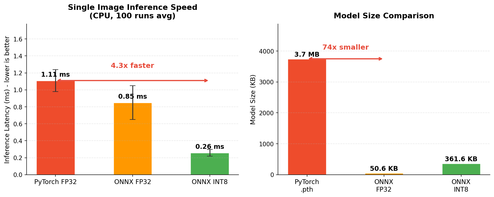

<p align="center">
  <h1 align="center">🖍️ 数字识别系统_V2 / Digit Recognizer_V2 </h1>
  <p align="center">
    从模型量化到服务部署的全栈数字识别应用<br>
    <em>End-to-end digit recognition from model quatization to deployment</em>
  </p>
</p>

<p align="center">
  
  
  
  
  
  
  
  
  
</p>

---

## 📖 项目简介

**Digit Recognizer v2** 是一个基于 ONNX Runtime 推理引擎的全栈数字识别应用，覆盖 **ONNX 量化 → 服务封装 → Web 前端 → 容器化部署** 的完整链路。

v2 在 v1（PyTorch 推理 + FastAPI + Vue 3 + Docker）基础上，引入工业级模型优化技术栈，核心升级体现为以下四大维度：

> 🚀 **模型优化** — PyTorch FP32 → ONNX FP32 导出 → **INT8 静态量化**（MinMax 校准），推理速度 **↑ 4.3 倍**（1.11ms → 0.26ms），模型体积 **↓ 10.4 倍**（3.7MB → 362KB）
>
> 🐳 **生产部署** — ONNX Runtime 图优化（ORT_ENABLE_ALL）+ Gunicorn 多进程 + Nginx 反向代理，Docker 镜像 **↓ 75%**（1.2GB → 300MB），**跨平台一键部署（macOS / Windows / Linux）**
>
> 📐 **工程规范** — uv 包管理 + Makefile 自动化 + 多阶段 Docker 构建 + 混合数据集校准策略
>
> 🧪 **质量保障** — **109 项**全链路测试（pytest + vitest + Playwright），后端代码覆盖率 **95%**，性能基准测试持续追踪



| 指标 | PyTorch FP32 | ONNX FP32 | ONNX INT8 (Quantized) | 提升 |
|------|:-----------:|:---------:|:--------------------:|:----:|
| 推理耗时 | 1.11 ms | 0.85 ms | **0.26 ms** | **↑ 4.3x** |
| 模型体积 | 3,748 KB | 50.6 KB | 361.6 KB | **↓ 10.4x** |
| 推理框架 | PyTorch 2.11 | ONNX Runtime | ONNX Runtime (INT8) | — |
| Docker 镜像 | ~1.2 GB | ~300 MB | ~300 MB | **↓ 75%** |

---

## 🛠️ 技术栈

| 层级 | 技术 |
|------|------|
| **模型量化** | ONNX, ONNX Runtime, ONNX Script |
| **后端推理** | ONNX Runtime, FastAPI, Gunicorn + UvicornWorker |
| **前端** | Vue 3 (Composition API), Vite, vue-i18n, Axios |
| **数据库** | SQLite (PRAGMA 版本迁移) |
| **容器化** | Docker (多阶段构建), Docker Compose, Nginx |
| **测试** | pytest + coverage + pytest-benchmark, vitest + vue-test-utils, Playwright |
| **包管理** | uv (Python), npm (Node) |

---

## 🏗️ 系统架构

```
┌─────────────────────────────────────────────────────────┐
│                   用户浏览器 (Vue 3)                      │
│  ┌─────────────┐  ┌──────────────┐  ┌───────────────┐  │
│  │  SinglePredict │  │ BatchPredict │  │   History    │  │
│  └──────┬──────┘  └──────┬───────┘  └───────┬───────┘  │
│         │                │                  │           │
│         └────────────────┼──────────────────┘           │
│                    Axios API 调用                        │
└──────────────────────────┬──────────────────────────────┘
                           │ HTTP
                           ▼
┌─────────────────────────────────────────────────────────┐
│                    Nginx (反向代理)                       │
│  - API 路由代理 (/api/* → backend:8000)                  │
│  - 静态资源服务 (frontend dist)                           │
│  - Gzip 压缩 / 超时控制 / 缓存策略                        │
└──────────────────────────┬──────────────────────────────┘
                           │
                           ▼
┌─────────────────────────────────────────────────────────┐
│              FastAPI (Gunicorn + Uvicorn)                │
│  ┌─────────────┐  ┌──────────────┐  ┌───────────────┐  │
│  │  /predict   │  │ /batch_predict│  │ /api/*        │  │
│  └──────┬──────┘  └──────┬───────┘  └───────┬───────┘  │
│         │                │                  │           │
│         ▼                ▼                  ▼           │
│  ┌──────────────────────────────────────────────────┐   │
│  │           ONNX Runtime InferenceSession           │   │
│  │  ┌─────────────────────────────────────────────┐  │   │
│  │  │  quantized_digit_recognizer.onnx (INT8)     │  │   │
│  │  │  GraphOptimizationLevel.ORT_ENABLE_ALL      │  │   │
│  │  │  CPUExecutionProvider                       │  │   │
│  │  └─────────────────────────────────────────────┘  │   │
│  └──────────────────────────────────────────────────┘   │
│                         │                                │
│                         ▼                                │
│  ┌──────────────────────────────────────────────────┐   │
│  │              SQLite Database                      │   │
│  │  - prediction_history 表                          │   │
│  │  - batch_results 表                               │   │
│  └──────────────────────────────────────────────────┘   │
└─────────────────────────────────────────────────────────┘
```

### 请求处理流程

```
用户上传图片 → Nginx 路由 → FastAPI 接收 → PIL 预处理
    → ONNX Runtime 推理 → 后处理 (Softmax 置信度)
    → 返回 JSON (预测值 + 置信度 + 耗时)
    → 可选保存至 SQLite → 前端展示结果
```

---

## 🚀 快速开始

> 💡 **跨平台提示**：本项目基于 Docker 容器化，支持 **macOS / Windows / Linux** 三平台一键部署，无需手动配置 Python 或 Node 环境。

### macOS / Linux

```bash
# 一键构建并启动
make up

# 访问 http://localhost:8080
# API 文档 http://localhost:8000/docs
```

### Windows

> 前提：安装 [Docker Desktop](https://www.docker.com/products/docker-desktop/)（启用 WSL2 后端）

```bash
# 克隆仓库
git clone https://github.com/你的用户名/Digit_recognizer_quant.git
cd Digit_recognizer_quant

# 构建并启动（Windows 上用 docker compose 替代 make）
docker compose up -d --build

# 访问 http://localhost:8080
# API 文档 http://localhost:8000/docs

# 查看日志
docker compose logs -f

# 停止服务
docker compose down
```

### 本地开发（通用）

```bash
# 后端
make install
make dev-backend

# 前端
make install-frontend
make dev-frontend
```

### 运行测试（通用）

```bash
# 后端测试（56 项）
make test-backend

# 前端测试（45 项）
make test-frontend

# 性能基准测试
uv run pytest tests/test_performance.py --benchmark-only
```

---

## 📌 版本规划

| 版本 | 状态 | 特性 |
|:----:|:----:|------|
| **v1** | ✅ 已完成 | 全栈数字识别：PyTorch 训练 + FastAPI + Vue 3 + Docker |
| **v2** | ✅ 已完成 | **ONNX 量化加速**：INT8 静态量化 + ONNX Runtime 推理 + 生产级部署 + 全链路测试 |
| **v3** | 📋 规划中 | **Optuna AutoML 自动调参** — 超参数自动搜索，进一步提升模型精度与训练效率 |

---

## 📄 许可证

本项目采用 MIT 许可证。详见 [LICENSE](LICENSE) 文件。

---

<p align="center">
  <sub>Built with ONNX Runtime, FastAPI, Vue 3, and Docker</sub>
</p>
